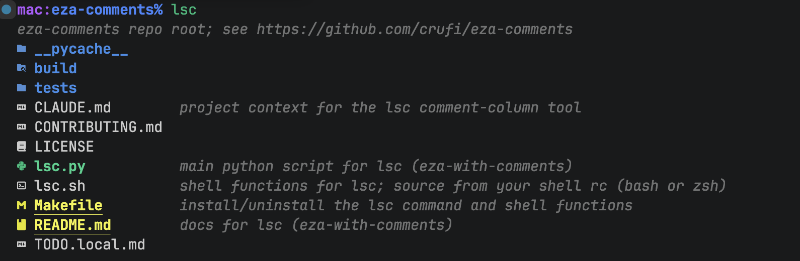

# lsc: eza listing with comments

> A single-file Python wrapper that adds an aligned, per-file comment column to
> [`eza`](https://github.com/eza-community/eza) — colors and Nerd Font icons
> intact, no dependencies.

A Python tool that runs an `eza` listing once, then annotates each file with
a short comment in an aligned column to the right of the names. Colors and
Nerd Font icons are preserved; the layout adapts to terminal width and clips
so no line ever wraps. When no file in the listing has a comment, output is
byte-identical to plain eza.

<!-- comment: replace docs/screenshot.png with a real terminal capture before publishing -->

Requirements: Python 3.8+ (uses the walrus operator), [`eza`](https://github.com/eza-community/eza),
and a Nerd Font for icons (see below). `wcwidth` is used if importable but is
not required.

## Prior art

The idea of per-file descriptions in a listing is old. 4DOS/Take Command stored
them in a per-directory `DESCRIPT.ION` file; `dirnotes`, `fdir`, Directory Opus,
and macOS Finder comments cover similar ground. `lsc` differs in two ways: it
layers comments onto `eza`'s real output (so colors, icons, and `--classify`
indicators survive), and it prefers an in-file `comment:` line over any sidecar
store — that comment travels with the file's own bytes through iCloud, `rsync`,
and atomic editor saves, which is exactly what xattr- and database-backed tools
lose.

## Where comments come from

For each file, `lsc` looks for a comment in two places, in order of precedence:

1. An in-file magic line near the top of a text file, matching `comment:`
   after a comment marker. Markers recognized: `//`, `#`, `--`, `;`. The match
   is case-insensitive and tolerates leading indentation.

   (The first example below becomes the actual `lsc` comment for this `.md` file.)

       // comment: docs for my lsc (eza-with-comments) tool
       #  comment: so does this
       -- comment: and this

   Only the first 50 lines are scanned, and binary / non-UTF-8 files are
   skipped, so this is cheap and safe.

2. A per-directory manifest, `.lsc-comments.json`, mapping bare filename to
   comment. This is plain JSON content, so it syncs through iCloud and travels
   with the directory.

The magic line wins when both exist.

## Why a manifest instead of xattrs

An earlier version stored comments in a `user.comment` extended attribute.
That was dropped: iCloud sync strips non-Apple xattrs, so comments vanished on
sibling machines. The manifest is ordinary file content, so it survives iCloud
sync, file eviction, editor atomic-saves, and `rsync` to other machines. The
in-file magic line is even more durable (it is part of the file's bytes), so
it is preferred for text files; the manifest covers everything else, including
binaries where a magic line cannot live.

## Managing comments

    lsc                 list the current directory with comments
    lsc DIR             list DIR (comments resolved against DIR)
    lsc --probe-evicted read evicted iCloud files too (default skips them)
    lsc --probe         shorthand for --probe-evicted
    lsc --set FILE TEXT set FILE's manifest comment
    lsc --set . TEXT    caption the directory (header line above the listing)
    lsc --rm  FILE      remove FILE's manifest comment
    lsc --get FILE      print FILE's effective comment
    lsc --help          show this help and exit
    lsc --version       print the version and exit

### Directory caption

A manifest entry keyed `.` is the directory's own caption. Set it with
`setcomm . "these are my tools"` (i.e. `lsc --set . "..."`), and it prints as a
header line above the listing — left-aligned at column zero, in the same dim
italic as comments. It lives in the manifest only (a directory has no head to
scan for a magic line), keyed `.` in that directory's `.lsc-comments.json`, so
it travels with the folder like any other comment. `lsc --set otherdir/. "..."`
captions another directory.

`--set` refuses if FILE does not exist (catches typos and wrong-directory
mistakes). `--set` and `--rm` still act, but warn on stderr, when an in-file magic
line shadows the manifest — because the magic line is what the listing will
actually show. If the directory is read-only, `--set`/`--rm` print a clean error
and exit non-zero rather than crashing; listing a read-only directory is
unaffected.

## Terminal-width behavior

The listing adapts to the current terminal width:

- The name column may grow up to `NAME_FRAC` of the terminal (clamped to
  `[NAME_MIN, NAME_MAX]`), so wide terminals show longer names before
  truncating and narrow ones cut sooner.
- The comment column starts just past the longest shown name.
- Comment text is clipped with an ellipsis so the whole line fits the terminal
  and never wraps to the next row.
- When `lsc` output is piped or redirected (not a terminal), width detection
  falls back to `FALLBACK_WIDTH`, which is the right behavior — no point
  truncating to a window that isn't there.

Other display details: comment text is shown dim + italic (via
`COMMENT_STYLE`), and truncated names get a trailing ellipsis. If no file has
a comment, the listing is passed through unchanged.

## Install

    make install            # lsc -> ~/.local/bin, lsc.sh -> ~/.local/share/lsc
    make install PREFIX=/usr/local
    make install BINDIR=~/bin

`make install` copies the `lsc` command to a bin directory on your `PATH` and
the `lsc.sh` shell functions to a data directory; it prints the exact `source`
line to add to your shell rc (`~/.bashrc` or `~/.zshrc`), and warns if the bin
directory is not on your `PATH`. `make uninstall` removes both. There are no pip
packages to install; lsc is a single Python 3.8+ script. See the shell-functions
section below.

## Nerd Font (needed for icons)

eza emits Private Use Area codepoints for icons; without a Nerd Font selected
in the terminal you get tofu boxes. Install one and pick the Mono variant
(single-cell glyphs, which the alignment math assumes):

    brew install --cask font-jetbrains-mono-nerd-font

Then set the terminal font to "JetBrainsMono Nerd Font Mono". Test:

    eza --icons=always

lsc recognizes icon glyphs across all three Nerd Font PUA ranges (the BMP area
and both Supplementary areas), so any modern Nerd Font icon is stripped
correctly when resolving the filename.

## Shell functions

The functions work in bash or zsh. `make install` puts `lsc.sh` at
`$PREFIX/share/lsc/lsc.sh` (so by default `~/.local/share/lsc/lsc.sh`) and
prints the line to add to your shell rc (`~/.bashrc` or `~/.zshrc`):

    source ~/.local/share/lsc/lsc.sh

It loads on the next shell. (If you would rather not install it, you can source
the copy in the repo instead — it is the same file.) The file sets `_eza_ignore`
to the manifest's filename, merging with any value you already have, so an
eza-based `ls` can hide the manifest; and it defines the `setcomm` / `rmcomm` /
`getcomm` wrappers around `lsc --set|--rm|--get`. The `lsc` command itself comes from
`make install` and needs no function; to use the comment column for every
listing, `alias ls=lsc`.

## Usage

    setcomm runcpp.sh "compile+run wrapper with magic-comment flags"
    setcomm archive.zip "Q2 board deck, do not delete"
    lsc                 # current directory
    lsc ~/bin           # another directory, from anywhere

Directory argument support: `lsc DIR` resolves names against DIR, so comment
lookups work even when run from a different working directory. This covers the
single-directory case only. Multiple paths, file arguments, or globs fall back
to current-directory name resolution, because eza's --oneline output does not
record which directory each line came from.

## Tunables (top of lsc.py)

    MANIFEST_NAME  = ".lsc-comments.json"  # per-directory comment store
    NAME_FRAC      = 0.5     # max share of terminal width for the name column
    NAME_MIN       = 20      # never truncate names shorter than this
    NAME_MAX       = 60      # never let the name column grow past this
    GAP            = 2       # gap between names and the comment column
    FALLBACK_WIDTH = 80      # width used when output is piped (no tty)
    COMMENT_STYLE  = "2;3"   # ANSI SGR for comments: 2=dim, 3=italic; "" = plain
    DATALESS_PLACEHOLDER = "(not downloaded)"  # shown for evicted iCloud files

To pin the column instead of letting it shift as you resize, set `NAME_MIN`
and `NAME_MAX` close together (e.g. both near 38).

## Notes and caveats

- iCloud-evicted files are not read by default. Reading a file's head to find
  its magic `comment:` line would force macOS to download an evicted ("Optimize
  Mac Storage") file, so the listing skips that probe for dataless files and
  shows their manifest comment if one exists, otherwise a `(not downloaded)`
  placeholder, right-aligned to the terminal edge to read as a status note
  rather than a description (`DATALESS_PLACEHOLDER`; set to `""` to disable). Pass
  `--probe-evicted` / `--probe` (or set `LSC_PROBE_EVICTED=1`) to read them anyway,
  accepting the downloads. This is a no-op off macOS, where the dataless flag
  does not exist.
- The manifest is keyed by bare filename and lives in the directory, so it
  travels when you move the folder. Renaming a file leaves its entry stale
  (harmless — it just stops matching). There is no `mv` subcommand yet to
  rename a key alongside a file.
- Width is counted by codepoint, correct for ASCII names and single-cell Nerd
  Font glyphs. Install `wcwidth` (`pip install wcwidth`) for exact alignment
  with wide CJK or emoji filenames; the script uses it automatically if present.
- The manifest is written atomically (temp file + rename) so an interrupted
  write cannot corrupt it. A failed write (read-only directory) leaves no
  orphaned temp file. An emptied manifest deletes its file rather than leaving
  an empty JSON object.
- The interactive `ls` uses `--icons=auto`; `lsc` forces `--icons=always`
  internally because it pipes eza but still wants glyphs rendered.

## Minor missing features

- A `mv` subcommand to move a manifest entry when a file is renamed. (But in practice, I prefer inline text comments anyway.)
- Multi-directory arguments (`lsc dir1 dir2`) would need parsing eza's section
  headers to know which directory each name belongs to.
- Surviving into `eza -l` long-format output would need rework, since long
  format puts the name at the end of a metadata row.
